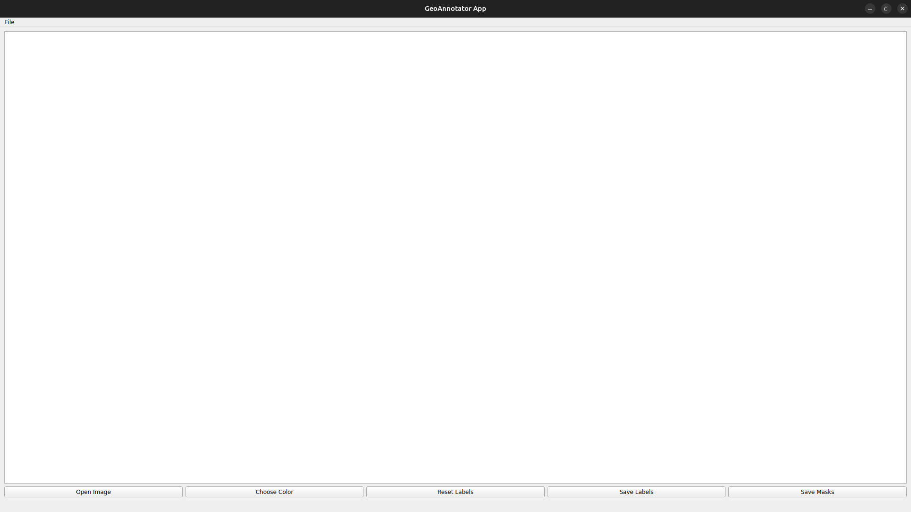

<div align="center">

# GeoAnnotator

Annotation for lithologies

> Status: v1.0.0.0 released


</div>

```
Resources:

Python: python3.8 venv
Pip packages: Pillow, Tkinter, Numpy, OpenCV

Status: Ongoing
```
> Licence: BSD 3-Clause


<div align="center">

> SCREENSHOTS



</div>