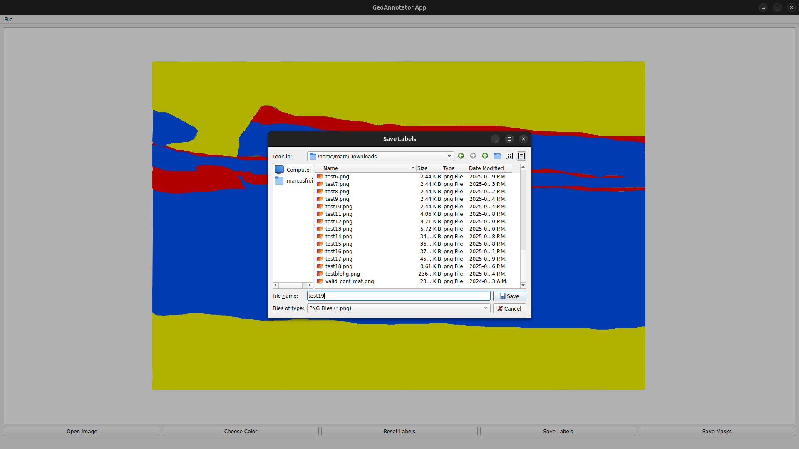

<div align="center">

# GeoAnnotator

Annotation for lithologies

> Status: v1.0.0.0 (alpha) on-going


</div>

```
Resources:

Python: python3.8 venv
Pip packages: Pillow, Tkinter, Numpy, OpenCV

Status: On-going
```

```
Installation for the source project:

*Recommendation: set Python Venv - version 3.8

Install all the requirements in requirements.txt
```

```
Instructions to create masks:

01 - File >> Create Project Path;
02 - File >> Open Image to Mask;
03 - Mask the region of interest with the left mouse button, click with the right mouse button to finish the polygon & press the key 'd' when this is done;
04 - File >> Save & Separate Mask from Image;
05 - Press the key 'Enter' to save all the results (masks & image masked).

Done

```
> Licence: BSD 3-Clause


> SCREENSHOTS
<div align="center">

### Screenshot 1


### Screenshot 2


### Screenshot 3


### Screenshot 4


### Screenshot 5



### Screenshot 6


</div>